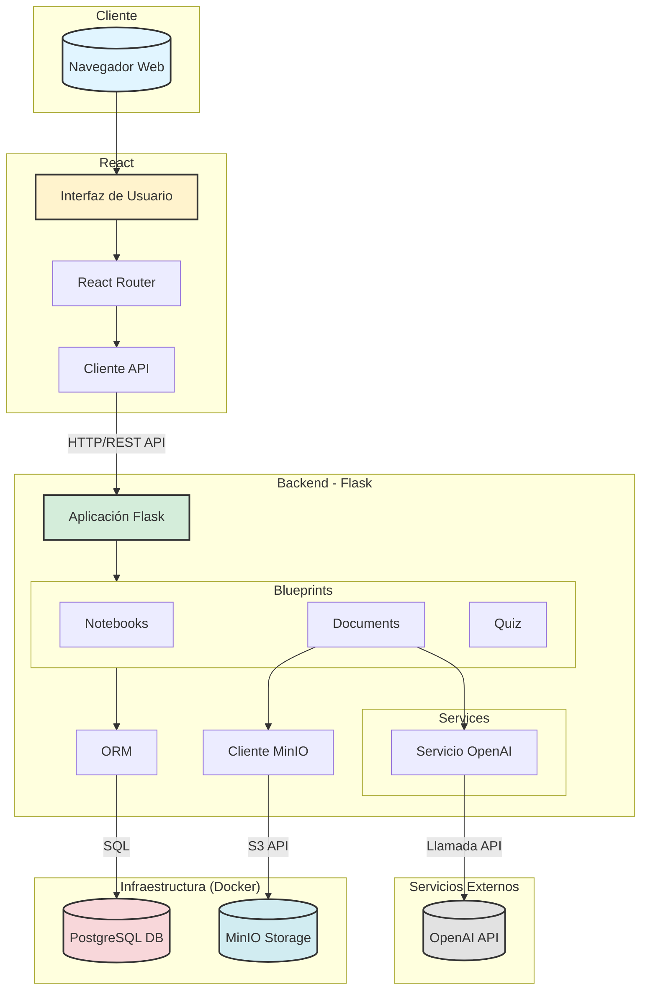
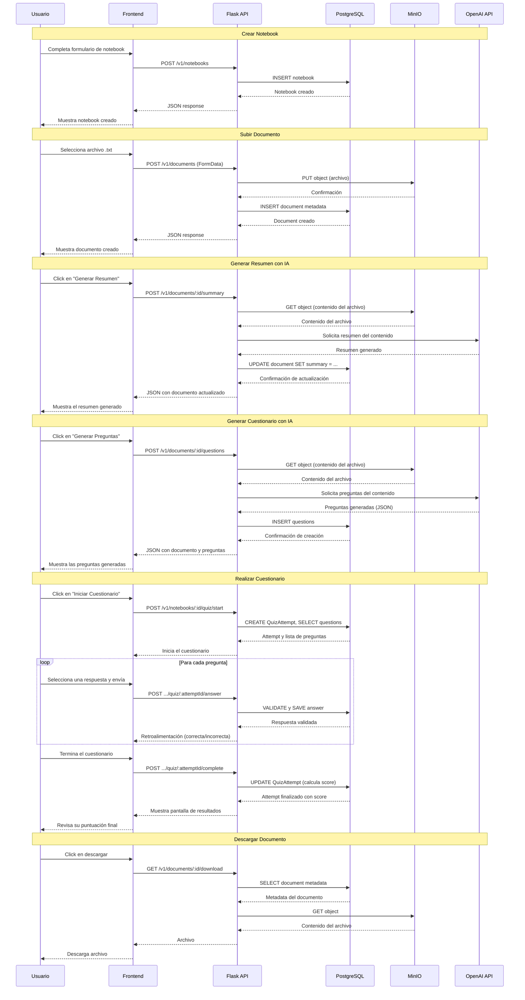

# RTVR - Sistema de Gestión de Documentos y Notebooks

RTVR es un sistema inteligente de gestión de documentos y notebooks construido con Flask (backend), PostgreSQL (base de datos), MinIO (almacenamiento de objetos) y React Router v7 (frontend). La aplicación no solo permite a los usuarios organizar documentos dentro de notebooks, sino que también integra capacidades de IA para generar resúmenes automáticos y cuestionarios de opción múltiple a partir del contenido de los documentos, convirtiendo el material de estudio en una experiencia de aprendizaje interactiva.

## Características

- **Gestión de Notebooks**: Crea, edita y elimina notebooks con categorización por colores, visibilidad y materia
- **Gestión de Documentos**: Sube, visualiza y gestiona archivos de texto (.txt)
- **Almacenamiento en MinIO**: Almacenamiento de objetos escalable para archivos
- **API RESTful**: API versionada (v1) con endpoints completos CRUD
- **Interfaz Moderna**: UI construida con React Router v7 y Tailwind CSS v4
- **Modo Oscuro**: Soporte completo para modo oscuro en toda la aplicación

## Arquitectura

### Diagrama de Arquitectura



### Flujo de Datos



### Backend (Flask)

El backend sigue una arquitectura Flask modular:

- **app.py** - Punto de entrada que inicializa Flask, SQLAlchemy, MinIO y registra los blueprints.
- **database.py** - Instancia singleton de SQLAlchemy para la gestión de la base de datos.
- **services/** - Lógica de negocio y servicios externos:
  - `openai_service.py` - Gestiona las interacciones con la API de OpenAI para generar resúmenes y preguntas.
- **models/** - Modelos de datos SQLAlchemy:
  - `notebook.py` - Modelo para los notebooks.
  - `document.py` - Modelo para los documentos, que puede contener un resumen (`summary`).
  - `question.py` - Modelo para las preguntas de opción múltiple generadas por IA para un documento.
  - `quiz_attempt.py` - Registra un intento de cuestionario realizado por un usuario en un notebook.
  - `quiz_answer.py` - Almacena la respuesta de un usuario a una pregunta específica durante un intento.
- **routes/** - Endpoints de la API organizados en blueprints:
  - `notebooks.py` - Operaciones CRUD para notebooks.
  - `documents.py` - CRUD para documentos y endpoints para la generación de resúmenes (`/summary`) y preguntas (`/questions`).
  - `quiz.py` - Endpoints para iniciar, responder y completar cuestionarios.

**Relaciones**: Un `Notebook` tiene muchos `Document`. Un `Document` tiene muchas `Question`. Un `Notebook` tiene muchos `QuizAttempt`. Un `QuizAttempt` tiene muchas `QuizAnswer`. Al eliminar un notebook, se eliminan en cascada todos sus componentes asociados.

### Base de Datos

- PostgreSQL 15 (Alpine) ejecutándose en Docker
- Gestión de conexiones vía SQLAlchemy ORM
- Configuración mediante variables de entorno

### Almacenamiento de Archivos

- MinIO para almacenamiento de objetos S3-compatible
- Bucket: `rtvr-documents`
- Consola web disponible en http://localhost:9001
- API en puerto 9000

### Frontend

- React Router v7 con enrutamiento basado en archivos y SSR
- Tailwind CSS v4 con soporte para modo oscuro
- TypeScript para seguridad de tipos
- Componentes reutilizables para formularios y vistas

## Requisitos Previos

- Docker y Docker Compose
- Python 3.8+
- Node.js 18+ y npm/yarn/pnpm
- Git

## Instalación

### 1. Clonar el Repositorio

```bash
git clone <URL_DEL_REPOSITORIO>
cd rtvr
```

### 2. Configurar el Backend

```bash
cd backend

# Crear entorno virtual
python -m venv .venv

# Activar entorno virtual
# En macOS/Linux:
source .venv/bin/activate
# En Windows:
.venv\Scripts\activate

# Instalar dependencias
pip install -r requirements.txt
```

### 3. Configurar Variables de Entorno

Las variables de entorno ya están configuradas en `backend/.env`:

**Nota Importante**: Para que las funcionalidades de IA (resúmenes y cuestionarios) funcionen, debes agregar tu propia `OPENAI_API_KEY`.

```env
# Configuración de Base de Datos
DB_USER=rtvr_user
DB_PASSWORD=rtvr_password
# Usa 127.0.0.1 o localhost si ejecutas el backend localmente y la BD en Docker
DB_HOST=127.0.0.1
DB_PORT=55432
DB_NAME=rtvr_db

# Configuración de Carga de Archivos
UPLOAD_FOLDER=uploads
MAX_FILE_SIZE=16777216

# Configuración de MinIO
# Usa 127.0.0.1 o localhost si ejecutas el backend localmente y MinIO en Docker
MINIO_ENDPOINT=127.0.0.1:9000
MINIO_ACCESS_KEY=rtvr_minio
MINIO_SECRET_KEY=rtvr_minio_password
MINIO_BUCKET_NAME=rtvr-documents
MINIO_SECURE=False

# Clave de API de OpenAI (requerida para resúmenes y cuestionarios)
OPENAI_API_KEY=<TU_API_KEY_DE_OPENAI>
```

### 4. Iniciar Servicios con Docker

```bash
# Desde el directorio raíz del proyecto
docker-compose up -d
```

Esto iniciará:
- PostgreSQL en el puerto `55432`
- MinIO API en el puerto `9000`
- MinIO Console en el puerto `9001`

### 5. Iniciar el Backend

```bash
cd backend
python app.py
```

El API estará disponible en http://127.0.0.1:5000

### 6. Configurar e Iniciar el Frontend

```bash
cd frontend

# Instalar dependencias
npm install

# Iniciar servidor de desarrollo
npm run dev
```

El frontend estará disponible en http://localhost:5173

## Uso

### Acceder a la Aplicación

1. Abre tu navegador en http://localhost:5173
2. Navega a "Notebooks" para crear un nuevo notebook
3. Dentro de un notebook, puedes agregar documentos (.txt)
4. Los archivos se almacenan automáticamente en MinIO

### Consola de MinIO

Para ver los archivos almacenados:

1. Abre http://localhost:9001
2. Inicia sesión con:
   - Usuario: `rtvr_minio`
   - Contraseña: `rtvr_minio_password`
3. Navega al bucket `rtvr-documents`

### API Endpoints

Todos los endpoints están prefijados con `/v1`:

#### Notebooks

- `GET /v1/notebooks` - Listar todos los notebooks
- `GET /v1/notebooks/<id>` - Obtener un notebook específico
- `GET /v1/notebooks/<id>?include_documents=true` - Obtener notebook con documentos anidados
- `GET /v1/notebooks/<id>/documents` - Listar documentos de un notebook
- `POST /v1/notebooks` - Crear nuevo notebook
- `PUT /v1/notebooks/<id>` - Actualizar notebook
- `DELETE /v1/notebooks/<id>` - Eliminar notebook

#### Documentos

- `GET /v1/documents` - Listar todos los documentos
- `GET /v1/documents/<id>` - Obtener un documento específico
- `POST /v1/documents` - Crear nuevo documento (soporta FormData para carga de archivos)
- `PUT /v1/documents/<id>` - Actualizar documento
- `DELETE /v1/documents/<id>` - Eliminar documento (también elimina de MinIO)
- `GET /v1/documents/<id>/download` - Descargar archivo del documento
- `GET /v1/documents/<id>/content` - Obtener el contenido de texto extraído del documento

#### Funcionalidades de IA (Documentos)

- `POST /v1/documents/<id>/summary` - Generar un resumen para un documento
- `POST /v1/documents/<id>/questions` - Generar preguntas de opción múltiple para un documento
- `GET /v1/documents/<id>/questions` - Obtener las preguntas existentes de un documento

#### Cuestionarios (Quiz)

- `POST /v1/notebooks/<id>/quiz/start` - Iniciar un nuevo intento de cuestionario para un notebook
- `POST /v1/notebooks/<id>/quiz/<attemptId>/answer` - Enviar una respuesta para una pregunta
- `POST /v1/notebooks/<id>/quiz/<attemptId>/complete` - Finalizar un intento de cuestionario y calcular la puntuación
- `GET /v1/notebooks/<id>/quiz/history` - Obtener el historial de intentos de un notebook
- `GET /v1/notebooks/<id>/quiz/<attemptId>` - Obtener los detalles de un intento específico

## Estructura del Proyecto

```bash
rtvr/
├── backend/
│   ├── models/              # Modelos de SQLAlchemy
│   │   ├── document.py
│   │   ├── notebook.py
│   │   ├── question.py
│   │   ├── quiz_answer.py
│   │   └── quiz_attempt.py
│   ├── routes/              # Blueprints de la API
│   │   ├── documents.py
│   │   ├── notebooks.py
│   │   └── quiz.py
│   ├── services/            # Lógica de negocio y servicios externos
│   │   └── openai_service.py
│   ├── app.py
│   ├── database.py
│   ├── requirements.txt
│   └── .env
├── frontend/
│   ├── app/                 # Código fuente de React
│   │   ├── routes/
│   │   │   ├── home.tsx
│   │   │   ├── notebooks.tsx
│   │   │   ├── notebooks.new.tsx
│   │   │   ├── notebooks.$id.tsx
│   │   │   ├── notebooks.$id.edit.tsx
│   │   │   ├── notebooks.$id.documents.new.tsx
│   │   │   ├── notebooks.$id.quiz.history.tsx
│   │   │   ├── notebooks.$id.quiz.tsx
│   │   │   ├── documents.tsx
│   │   │   └── documents.$id.tsx
│   │   ├── services/
│   │   │   └── api.ts
│   │   ├── root.tsx
│   ├── package.json
│   └── tailwind.config.ts
├── docker-compose.yml
├── .gitignore
└── README.md
```

## Tecnologías Utilizadas

### Backend
- Flask 3.x
- Flask-SQLAlchemy 3.x
- Flask-CORS 5.x
- PostgreSQL (psycopg2-binary)
- MinIO SDK for Python
- OpenAI Python Library
- Python-dotenv

### Frontend
- React Router v7
- Tailwind CSS v4
- TypeScript
- Vite

### Infraestructura
- Docker & Docker Compose
- PostgreSQL 15 Alpine
- MinIO (última versión)
- OpenAI API (para resúmenes y cuestionarios)

## Desarrollo

### Comandos Útiles

```bash
# Detener servicios Docker
docker-compose down

# Reiniciar servicios Docker
docker-compose restart

# Ver logs de PostgreSQL
docker logs rtvr

# Ver logs de MinIO
docker logs rtvr-minio

# Limpiar volúmenes Docker (¡cuidado! esto eliminará todos los datos)
docker-compose down -v
```

### Estructura de Datos

#### Modelo Notebook

```typescript
interface Notebook {
  id: number;
  title: string;
  description: string | null;
  visibility: 'public' | 'private';
  subject: string | null;
  color_tag: string;
  document_count: number;
  created_at: string;
  updated_at: string;
  documents?: Document[];
}
```

#### Modelo Document

```typescript
interface Document {
  id: number;
  title: string;
  description: string | null;
  extracted_content: string;
  file_name: string;
  file_type: string;
  file_size: number;
  processed: boolean;
  notebook_id: number | null;
  created_at: string;
  updated_at: string;
}
```

## Solución de Problemas

### Error de Conexión a PostgreSQL

Si no puedes conectarte a PostgreSQL:
1. Verifica que Docker esté ejecutándose
2. Asegúrate de que el contenedor esté activo: `docker ps`
3. Verifica el puerto en `.env` (debe ser `55432`)

### Error de Conexión a MinIO

Si los archivos no se suben:
1. Verifica que MinIO esté ejecutándose: `docker ps`
2. Verifica las credenciales en `.env`
3. Revisa los logs: `docker logs rtvr-minio`

### Error CORS en el Frontend

Si ves errores CORS:
1. Asegúrate de que Flask-CORS esté instalado: `pip install Flask-CORS`
2. Verifica que el frontend esté ejecutándose en `http://localhost:5173`
3. Reinicia el servidor Flask

### Errores de Hidratación en React

Si ves errores de hidratación relacionados con Tailwind:
- Esto ya está resuelto usando mapas de clases estáticas
- No uses template literals con clases de Tailwind (ej: `` bg-${color}-500 ``)

## Contribuir

1. Fork el proyecto
2. Crea una rama para tu feature (`git checkout -b feature/AmazingFeature`)
3. Commit tus cambios (`git commit -m 'Add some AmazingFeature'`)
4. Push a la rama (`git push origin feature/AmazingFeature`)
5. Abre un Pull Request

## Licencia

Este proyecto es parte de un trabajo académico para el curso de Análisis, Diseño y Construcción de Software.

## Contacto

Para preguntas o soporte, por favor abre un issue en el repositorio.
